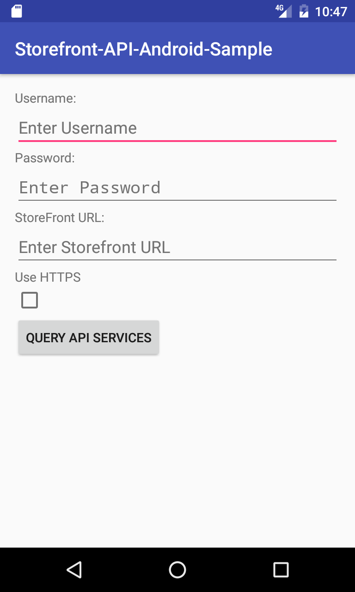
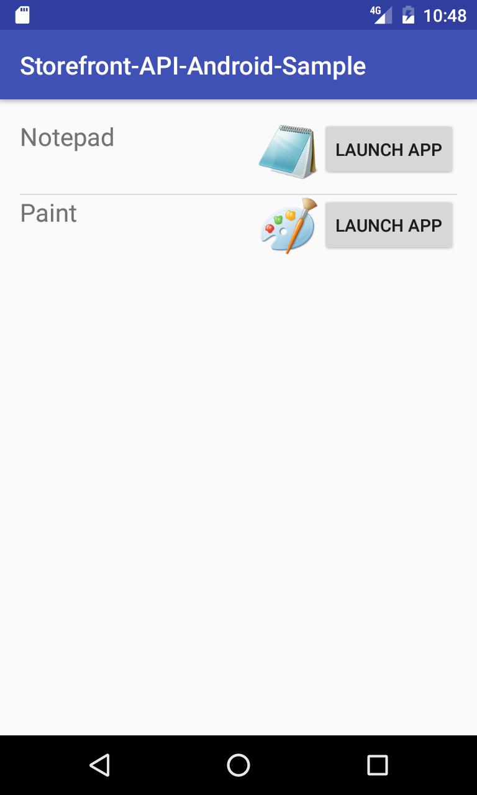

# Citrix Storefront API Android Sample

This sample is meant to show you how to interact with the
Citrix Storefront API to authenticate, List your available
resources, and generate an ICA file that you can then pass
on to something like Citrix Receiver to handle the connection. 

This is a base sample that shows how to use the Storefront API and will allow
you to build upon it to create your own solutions.

This sample is built for Android using [Android Studio](https://developer.android.com/studio/index.html).

Note:

----

This sample works best if you have Citrix Receiver installed on either your emulator or
the hardware device you are testing on. The reason for this is that once we get the ICA file
from storefront, we then save it to the storage and then pass it to the receiver application.

---

Currently, for this sample, we do not have the same helper functions available
as we do with the C#/Xamarin.Forms samples, but we are working on them. If you would
like to have these helper functions available, please let us know via our [@CitrixDeveloper](http://www.twitter.com/citrixdeveloper)
twitter feed.

If you would like to find the helper functions for C#, here is the nuget 
[link](https://www.nuget.org/packages?q=citrix) for the packages that include the storefront
helpers.

Here are some images that display the application. In the sample we have the following
  1. Login screen
  2. Application list screen

### Android
 
